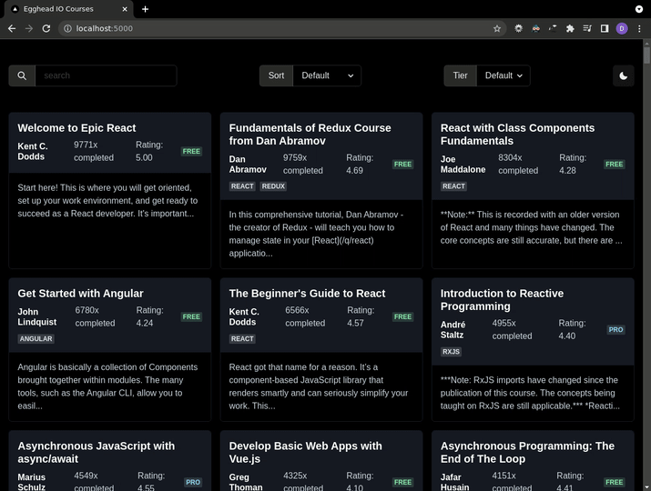

# Egghead

```
npm install @chakra-ui/react @emotion/react@^11 @emotion/styled@^11 framer-motion@^4
npm install @chakra-ui/icons
npm install fuse.js
npm install use-debounce
```



Some nice Chakra UI templates are here: https://chakra-templates.dev/.

## Dark Mode Scrollbar

In order to apply `color-scheme: dark` or `color-scheme: light` depending on the `colorMode`,
we can use the [global styling](https://chakra-ui.com/docs/features/global-styles#how-it-works)
provided by Chakra UI.

```ts
const customTheme: Partial<Theme> = {
  ...,
  styles: {
    global: (props) => ({
      html: {
        colorScheme: props.colorMode === 'dark' ? 'dark' : 'light'
      }
    })
  }
}
```

In order to set the `initialColorMode` to the `system` color,
I need to use the [ColorModeScript](https://chakra-ui.com/docs/features/color-mode#for-nextjs).

```tsx
<ColorModeScript initialColorMode={'system'} />
```

## Search with Fuse.js

I want to use debouncing.
So I installed [use-debounce](https://github.com/xnimorz/use-debounce).
For an example implemention, see [this useDebounce hook](https://usehooks.com/useDebounce/).
For discussion of the implementation, see [this blog post](https://dmitripavlutin.com/react-throttle-debounce/).

# Default

This is a [Next.js](https://nextjs.org/) project bootstrapped with [`create-next-app`](https://github.com/vercel/next.js/tree/canary/packages/create-next-app).

## Getting Started

First, run the development server:

```bash
npm run dev
# or
yarn dev
```

Open [http://localhost:3000](http://localhost:3000) with your browser to see the result.

You can start editing the page by modifying `pages/index.tsx`. The page auto-updates as you edit the file.

[API routes](https://nextjs.org/docs/api-routes/introduction) can be accessed on [http://localhost:3000/api/hello](http://localhost:3000/api/hello). This endpoint can be edited in `pages/api/hello.ts`.

The `pages/api` directory is mapped to `/api/*`. Files in this directory are treated as [API routes](https://nextjs.org/docs/api-routes/introduction) instead of React pages.

## Learn More

To learn more about Next.js, take a look at the following resources:

- [Next.js Documentation](https://nextjs.org/docs) - learn about Next.js features and API.
- [Learn Next.js](https://nextjs.org/learn) - an interactive Next.js tutorial.

You can check out [the Next.js GitHub repository](https://github.com/vercel/next.js/) - your feedback and contributions are welcome!

## Deploy on Vercel

The easiest way to deploy your Next.js app is to use the [Vercel Platform](https://vercel.com/new?utm_medium=default-template&filter=next.js&utm_source=create-next-app&utm_campaign=create-next-app-readme) from the creators of Next.js.

Check out our [Next.js deployment documentation](https://nextjs.org/docs/deployment) for more details.
